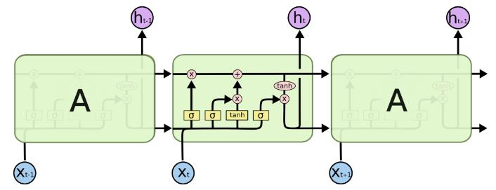
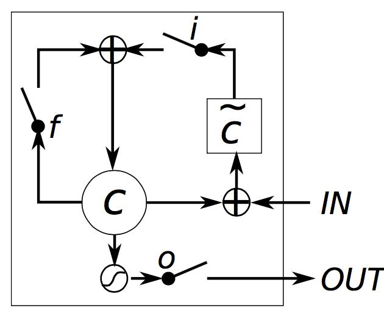

# RNN、LSTM、GRU解析

1. RNN

   人在阅读文字时，具有短暂的记忆，比如在阅读当前词汇时你会对之前的文字有一些印象，而不是全部丢弃前面的内容。对于神经网络，我们也需要这样的功能，即保持对之前内容的短暂记忆。而RNN递归神经网络提供了一种实现方法。

   

   

   

    最简单的RNN递归公式如下（其中$\hat{y}^{(t)}$是预测的概率向量，$y^{(t)}$是标量类别标签）：
   $$
   h^{(t)}=\tanh(Ux^{(t)}+Wh^{(t-1)}+b) \\
   o^{(t)}=Vh^{(t)}+c \\
   \hat{y}^{(t)}=\mathrm{softmax}(o^{(t)})\\
   L^{(t)}=-\log \hat{y}^{(t)}_{y_t}\\
   L=\sum L^{(t)}
   $$
   BPTT梯度回传算法：

   - ​

   - $$
     \nabla_{o_i^{(t)}}L=\nabla_{o_i^{(t)}} L^{(t)}=-\nabla_{o_i^{(t)}}\log \frac{\exp(o_{y^{(t)}}^{(t)})}{\sum_j\exp(o_j^{(t)})}=\hat{y}_i^{(t)}-\mathbf{l}\{i=y^{(t)}\}
     $$

   - 向量表示：
     $$
     \nabla_{o^{(t)}}L=\hat{\mathbf{y}}^{(t)}-\mathbf{y}^{(t)}
     $$
     其中$\mathbf{y}^{(t)}$是由标量标签扩展的one-hot向量。即总的损失对任意一个时刻的输出的导数都可以表示成上述形式。

   - 对最后一个时间$\tau$的导数：
     $$
     \nabla_{h^{(\tau)}}L=V^T\nabla_{o^{(\tau)}}L^{(t)}
     $$

   - 对于任意的$t<\tau$，$h^{(t)}$接收两个方向回传的梯度：$h^{(t+1)}$和$o^{(t)}$。
     $$
     \begin{align}\nabla_{h^{(t)}}L &=\left(\frac{\partial o^{(t)}}{\partial h^{(t)}}\right)^T\nabla_{o^{(t)}}L+\left(\frac{\partial h^{(t+1)}}{\partial h^{(t)}}\right)^T\nabla_{h^{(t+1)}}L \\ 
     &= V^T\nabla_{o^{(t)}}L + W^T\mathrm{diag}(1-(h^{(t+1)})^2)(\nabla_{h^{(t+1)}}L)\end{align}
     $$

   - 对参数的求导，因为所有时间步共享参数，因此需要对所有时间步累加导数。
     $$
     \nabla_c L = \sum_t \nabla_{o^{(t)}} L \\
     \nabla_b L=\sum_t \mathrm{diag}(1-(h^{(t)})^2)\nabla_{h^{(t)}}L \\
     \nabla_V L = \sum_t (\nabla_{o^{(t)}}L) (h^{(t)})^T \\
     \nabla_W L = \sum_t \mathrm{diag}(1-(h^{(t)})^2)(\nabla_{h^{(t)}}L) (h^{(t-1)})^T \\
     \nabla_U L = \sum_t  \mathrm{diag}(1-(h^{(t)})^2)(\nabla_{h^{(t)}}L) (x^{(t)})^T
     $$

   - 传统的RNN会有梯度消失问题，这是因为误差项累积相乘，也就是不能保持长期记忆。因此需要引入一些控制门缓解梯度消失，这样做会使得梯度误差项变成相加。

   ​

2. LSTM

   LSTM的提出是希望改善RNN缺少长期记忆的缺点。RNN当时间步达到一定长度时，模型很可能会忘掉之前的记忆。首先来看一张形象的LSTM模型图：

   

    

​	

​	首先，图中顶部贯穿的一条直线是每个胞元的内部状态$c_t$。三个sigmoid函数构成三个门：输入门，遗忘门，输出门。之所以叫“门”，是因为sigmoid能够将数值	归一化到（0，1）区间，当他和向量对应元素相乘时，能够决定这个向量的保留量。三个门的计算公式有相同的形式：
$$
i=\sigma(U_ix_t+W_ih_{t-1})\\
f=\sigma(U_fx_t+W_fh_{t-1})\\
o=\sigma(U_ox_t+W_oh_{t-1})
$$
上述公式有不同写法，比如，如果合并成一个矩阵写也可以：
$$
i=\sigma(W_i[x_t, h_{t-1}]+b_i)
$$
这与上面的式子是等价的，相当于将上面的$U_i$和$W_i$在1维度合并。

当从一个胞元过度到下一个时，首先要确定要忘记多少之前的状态，即使用遗忘门来控制过去状态$c_{t-1}$的权重。

然后，在当前状态，我们获得的新的知识需要计算，这种新的状态、输出状态一般用tanh激活函数，输出范围（-1，1），那么新的状态部分可以计算如下：
$$
\bar{c_t}=\tanh(U_cx_t+W_ch_{t-1})
$$
新状态使用输入门控制输入量，结合上面的遗忘门控制的旧状态占比，可计算出新的胞元状态：
$$
c_t=f*c_{t-1}+i*\bar{c_t}
$$
最后计算这个胞元的输出态，用输出门控制信息量：
$$
h_t=o_t*\tanh(c_t)
$$

RNN时LSTM的特殊情况：当输入门全1，遗忘门全0（总是抛弃过去的记忆），输出门全1时，就是一个RNN。

3. GRU

   GRU将LSTM的输入门和遗忘门合并成一个更新门$z$，并且将细胞状态和输出状态合并。

   

    

   

   公式如下：
   $$
   r_t=\sigma(U_rx_t+W_rh_{t-1})\\
   z_t=\sigma(U_zx_t+W_zh_{t-1})\\
   h_t=z_t*h_{t-1}+(1-z_t)\tanh(U_hx_t+W_h(r_t*h_{t-1}))
   $$
   ​

   ​

